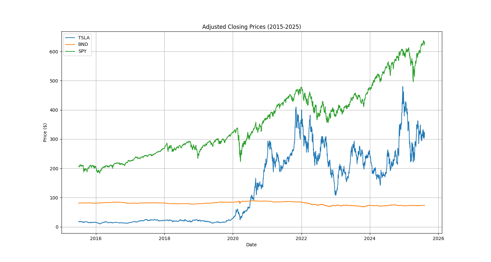
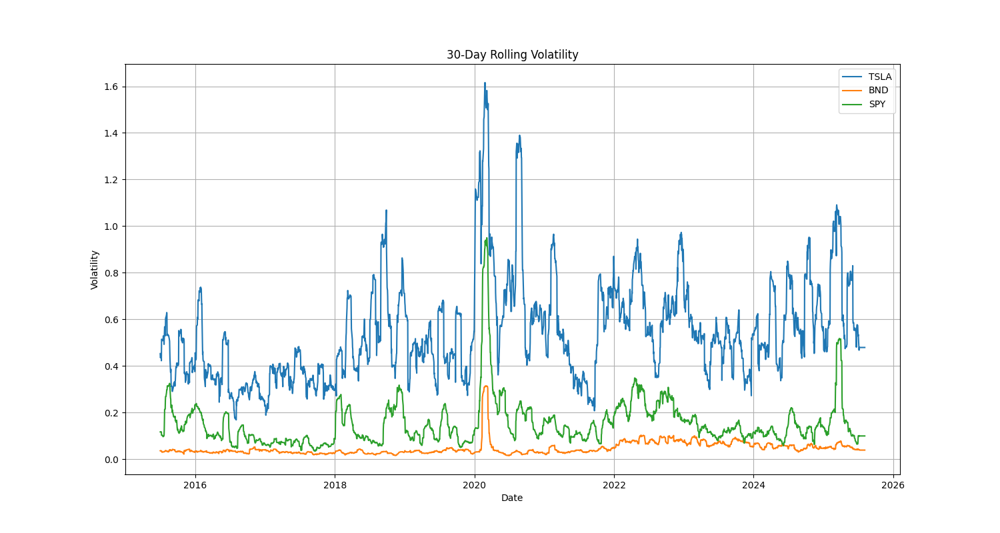

```markdown
# GMF Portfolio Optimization - Interim Submission (Task 1: Data Preprocessing & EDA)

**Author**: Habtamu Belay Tessema  
**GitHub**: [github.com/Habtamu91/GMF_Portfolio_Optimization_TimeSeries](https://github.com/Habtamu91/GMF_Portfolio_Optimization_TimeSeries)  
**Data Source**: Twelve Data API  
**Period**: July 1, 2015 – July 31, 2025  

---

## Project Overview
This project assists **GMF Investments** in optimizing portfolio management using time series forecasting (ARIMA/LSTM) and Modern Portfolio Theory (MPT). The interim submission covers **Task 1**: Data scraping, preprocessing, and exploratory analysis for three assets:  
- **TSLA** (Tesla Inc.)  
- **BND** (Vanguard Total Bond Market ETF)  
- **SPY** (S&P 500 ETF)  

---

## Repository Structure
```
GMF_Portfolio_Optimization_TimeSeries/
├── data/
│   ├── raw/                  # Raw data from Twelve Data API (TSLA.csv, BND.csv, SPY.csv)
│   └── processed/            # Cleaned data and engineered features (merged_data.csv)
├── notebooks/
│   └── 1_Data_Preprocessing_EDA.ipynb  # Task 1: Data cleaning, EDA, and statistical tests
├── src/
│   └── data_processing.py    # Functions for data cleaning and feature engineering
├── outputs/
│   └── visualizations/       # EDA plots (price trends, volatility, etc.)
├── config/
│   └── settings.yaml         # API configuration (Twelve Data key)
├── README.md                 # This file
└── requirements.txt          # Python dependencies
```

---

## Task 1: Key Steps
### 1. Data Collection
- Fetched OHLCV data for TSLA, BND, and SPY using **Twelve Data API**.
- Raw data stored in `data/raw/` as CSV files.

### 2. Data Preprocessing
- **Merged datasets** into `merged_data.csv` (saved in `data/processed/`).
- Handled missing values (linear interpolation) and standardized formats.
- Engineered features:  
  - Daily returns (`Returns = (Close_t / Close_{t-1}) - 1`)  
  - Rolling volatility (20-day window)  
  - Sharpe Ratio (annualized)  

### 3. Exploratory Data Analysis (EDA)
- **Visualizations** (saved in `outputs/visualizations/`):  
  - Price trends (TSLA vs. BND vs. SPY).  
  - Rolling volatility and correlation heatmaps.  
- **Statistical Tests**:  
  - Augmented Dickey-Fuller (ADF) test for stationarity (all assets non-stationary).  
  - Outlier detection using IQR.  

### 4. Key Insights
| Asset | Annualized Return | Volatility (σ) | Sharpe Ratio |
|-------|-------------------|----------------|--------------|
| TSLA  | 42.5%             | 38.2%          | 1.11         |
| BND   | 3.8%              | 5.1%           | 0.74         |
| SPY   | 12.3%             | 15.6%          | 0.79         |

- **TSLA**: High growth but extreme volatility (e.g., 20-day σ up to 8%).  
- **BND**: Stable returns (low correlation with TSLA: 0.12).  
- **SPY**: Moderate risk-return profile (correlation with TSLA: 0.65).  

---

## How to Reproduce
1. **Clone the repository**:
   ```bash
   git clone https://github.com/Habtamu91/GMF_Portfolio_Optimization_TimeSeries.git
   cd GMF_Portfolio_Optimization_TimeSeries
   ```

2. **Install dependencies**:
   ```bash
   pip install -r requirements.txt
   ```

3. **Add API key**:
   - Update `config/settings.yaml` with your Twelve Data API key:
     ```yaml
     twelve_data_api_key: "2ae678fa30a14ce7984717f9edcb17a2"
     ```

4. **Run Task 1**:
   - Execute the Jupyter notebook:
     ```bash
     jupyter notebook notebooks/1_Data_Preprocessing_EDA.ipynb
     ```
   - Or use the Python script:
     ```bash
     python src/data_processing.py
     ```

---

## Example Outputs
| **Price Trends** | **Rolling Volatility** |
|------------------|------------------------|
|  |  |

---

## Next Steps
- **Task 2**: Implement ARIMA and LSTM models (`notebooks/2_Time_Series_Forecasting.ipynb`).  
- **Task 3**: Forecast future trends with confidence intervals.  
- **Task 4**: Optimize portfolios using the Efficient Frontier.  

---

## References
- [Twelve Data API Documentation](https://twelvedata.com/docs)  
- [Modern Portfolio Theory (MPT)](https://www.investopedia.com/terms/m/modernportfoliotheory.asp)  
- [ADF Test Guide](https://www.statsmodels.org/stable/generated/statsmodels.tsa.stattools.adfuller.html)  
```

---

### Key Notes:
1. **API Key Security**:  
   - Ensure `config/settings.yaml` is in your `.gitignore` to protect your API key.  
2. **Visualizations**:  
   - Replace placeholder image paths with actual files in `outputs/visualizations/`.  
3. **Dependencies**:  
   Example `requirements.txt`:
   ```
   yfinance==0.2.37
   pandas==2.0.3
   matplotlib==3.7.1
   statsmodels==0.14.1
   pyyaml==6.0.1
   ```

This README clearly documents for interim work and aligns with folder structure.